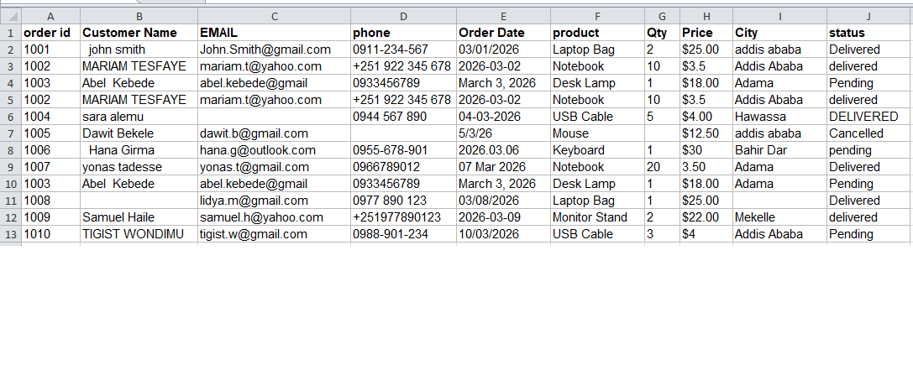
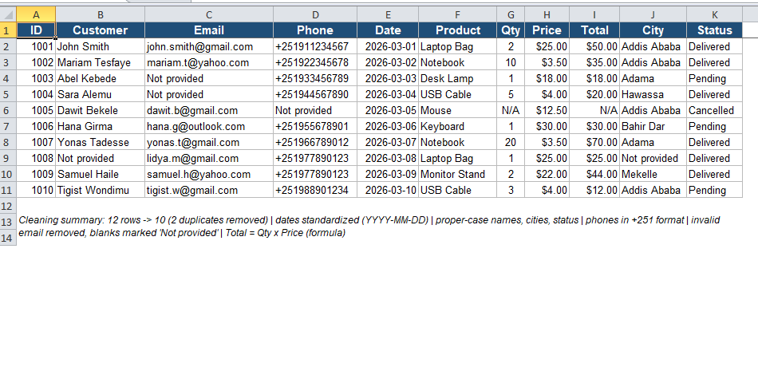

# Excel Data Cleaning Portfolio

Sample project showing how I clean messy customer order data in Excel.

## Before

## After

## What I did
- Removed 2 duplicate rows (12 → 10 records)
- Standardized dates to YYYY-MM-DD
- Fixed name, city and status capitalization
- Formatted phone numbers to +251 format
- Marked missing values as "Not provided" and noted issues
- Added a Total column (Qty × Price) using formulas

## Files
- orders_messy_before.xlsx – raw data
- orders_cleaned_after.xlsx – cleaned data
